<div align="center">


# QuickBite

**Café ordering & 10-minute delivery for iOS — inspired by Bistro by Blinkit.**

Swift · UIKit (programmatic) · MVVM + Coordinators · Core Data · async/await · Combine · MapKit · Objective-C interop
Node.js · Express · PostgreSQL · Prisma · Socket.IO · JWT · Razorpay (test) · FCM · GitHub Actions · fastlane

[](https://github.com/Shashwat0906/QuickBite/actions/workflows/backend.yml)
[](https://github.com/Shashwat0906/QuickBite/actions/workflows/ios.yml)

</div>

---

## ▶️ Run it in 5 minutes (for reviewers)

You only need a **Mac with Xcode 16+**. The backend is already deployed, so there's no server to set up.

```bash
brew install xcodegen cocoapods          # one-time tools
git clone https://github.com/Shashwat0906/QuickBite.git
cd QuickBite/ios
xcodegen generate && pod install
open QuickBite.xcworkspace               # the .xcworkspace, not the .xcodeproj
```

Choose any **iPhone simulator** and press **⌘R**. The first build downloads packages and takes a few minutes.

* Sign in with **demo@quickbite.app / Demo@1234**, or browse as a guest.
* Try this: open **Brew & Bloom** → customise a cappuccino → cart → coupon **WELCOME50** → checkout →
  **Demo payment** → *Simulate success* → watch the order move to *Delivered* live (one step every ~20 s).
* The app talks to the live API at <https://quickbite-api-0zul.onrender.com> ([health](https://quickbite-api-0zul.onrender.com/health)).
  It runs on Render's free tier, so if it has been idle the very first screen can take up to a minute to load.
* No Mac? See the [screenshots](#screenshots) and the [screen recording](docs/media/demo.mp4).

## What it does

Browse cafés near you → open a menu → customise a cappuccino (size, milk, extras) → add to cart
(works offline and as a guest) → sign in (email, Apple or Google) → checkout with a saved
address → pay (Razorpay test mode, a clearly labelled demo payment, or cash) → watch the order
move **live** from *Order placed* to *Delivered* on a step tracker and map → rate it → reorder.

| Feature | Highlights |
| --- | --- |
| **Home** | Greeting + delivery location, search, offer carousel, categories, featured cafés, popular dishes, nearby cafés sorted by distance, skeleton loading, pull-to-refresh, offline cache |
| **Cafés & menu** | Compositional layouts, veg-only toggle, jump-to-section menu, bestseller/veg/non-veg labels, sold-out states, customisation sheet with live price |
| **Search** | 300 ms debounced search (Combine), recent & trending searches, filter chips (veg, rating, price, availability), sort menu, highlighted matches, pagination |
| **Cart** | Core Data persistence, +/− and swipe-to-remove, edit customisations, coupons, server-validated prices & stock, free-delivery nudge, café-switch confirmation |
| **Checkout** | Address picker with MapKit pin + reverse geocoding, payment methods, bill breakdown, **idempotent** "Place order" (double taps can't create two orders), payment failure → retry/cancel |
| **Tracking** | Socket.IO live updates (own Engine.IO/Socket.IO client on `URLSessionWebSocketTask`), polling fallback, 6-step tracker with timestamps, MapKit map with a **clearly labelled simulated rider**, call café / support, cancel before preparation (auto-refund) |
| **Orders** | Active / past, reorder (skips unavailable items), rate & review delivered orders |
| **Profile** | Edit profile, addresses, payment preference, notification settings + inbox, my reviews, appearance (light/dark/system), server switcher & health, logout, **in-app account deletion** |
| **Push** | Firebase Cloud Messaging when configured; in-app banners + inbox as the fallback; notification taps deep-link to the order |

## Screenshots

Captured automatically by the [screenshots workflow](.github/workflows/screenshots.yml): the app running
on an iPhone simulator against the **real backend** (PostgreSQL + Node), signed in with the demo account.

| Home | Café menu | Customise | Cart |
| :---: | :---: | :---: | :---: |
| 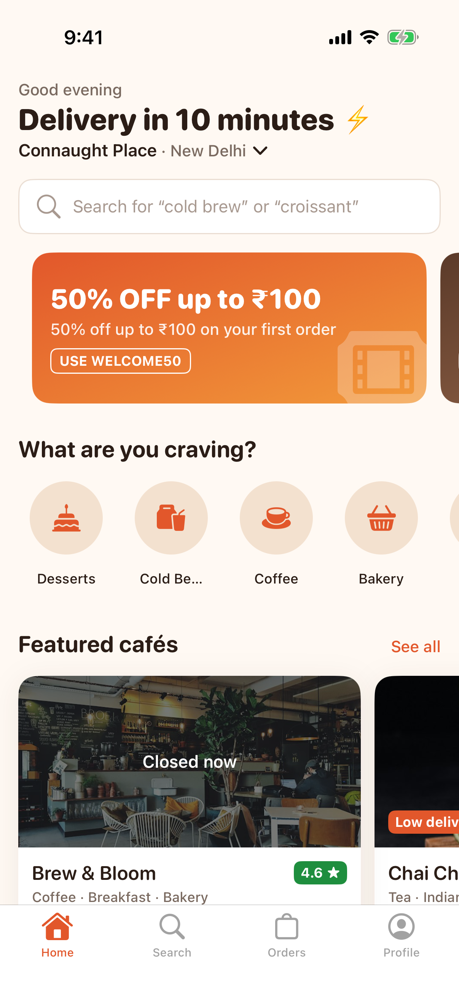 | 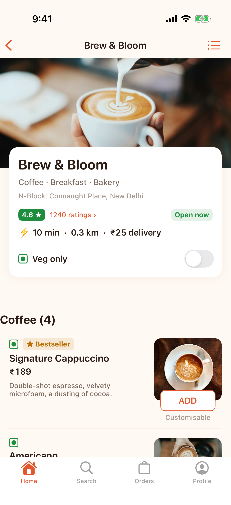 | 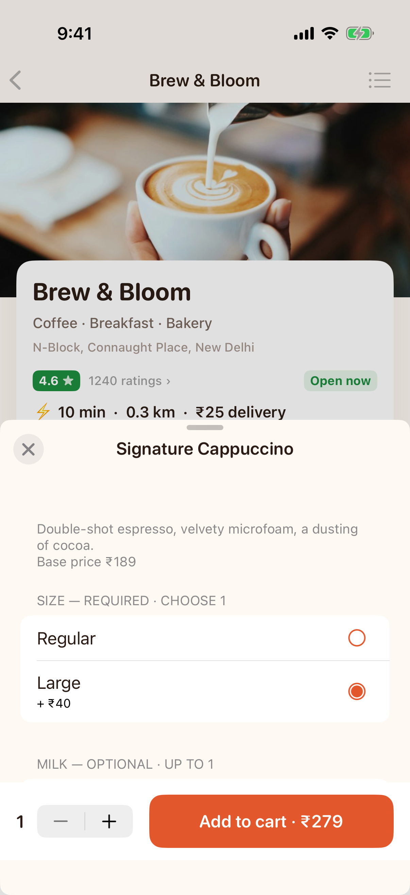 | 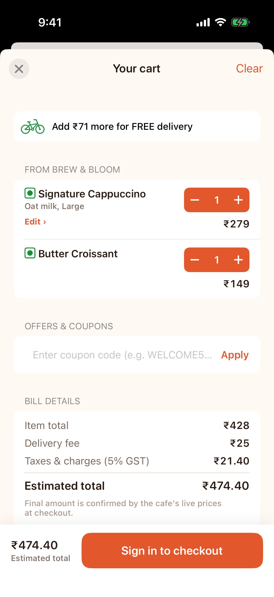 |
| **Checkout** | **Demo payment** | **Order placed** | **Live tracking** |
| 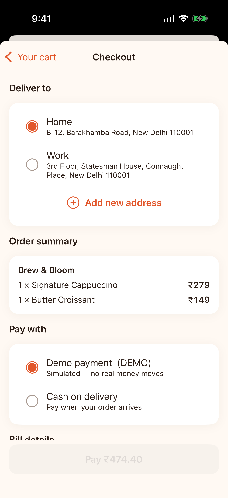 | 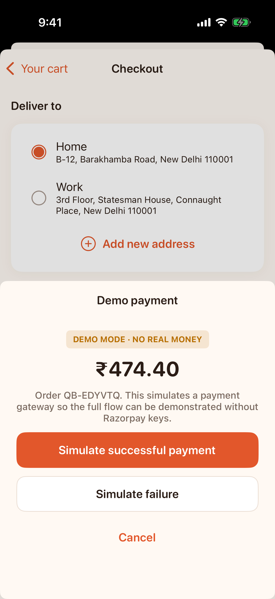 | 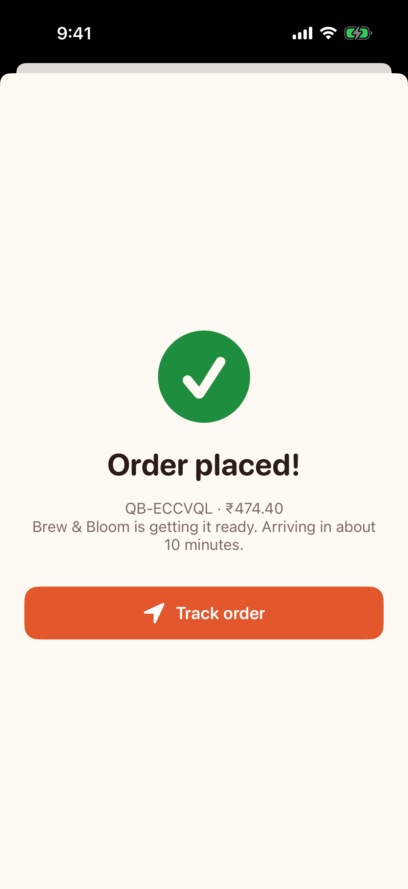 | 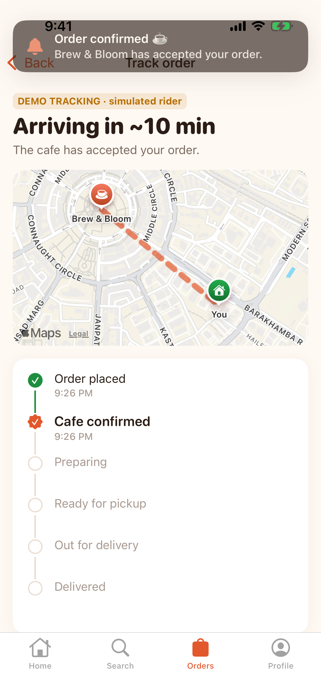 |
| **Onboarding** | **Sign in** | **More cafés** | **Tracking progress** |
| 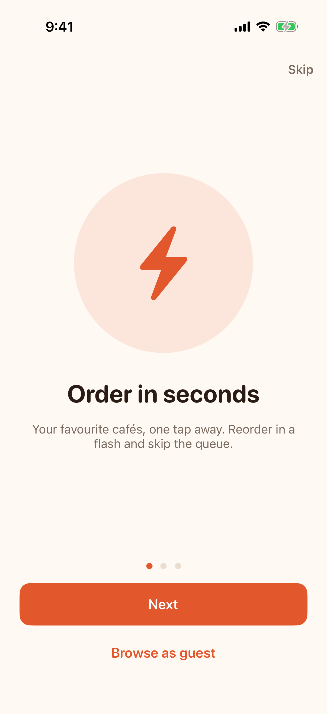 | 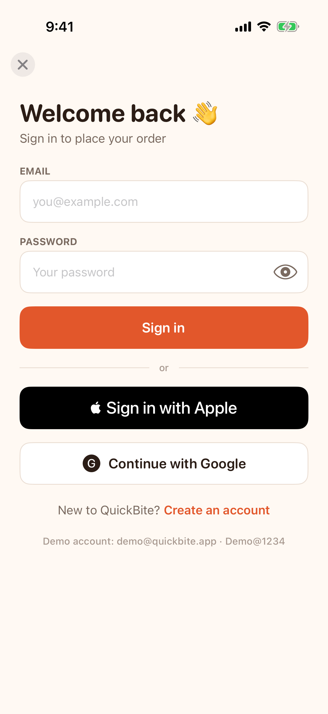 | 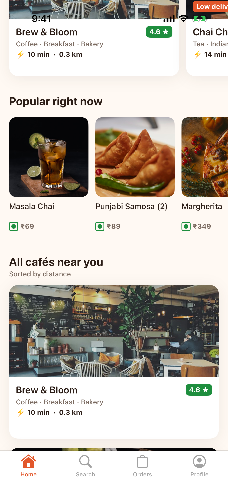 | 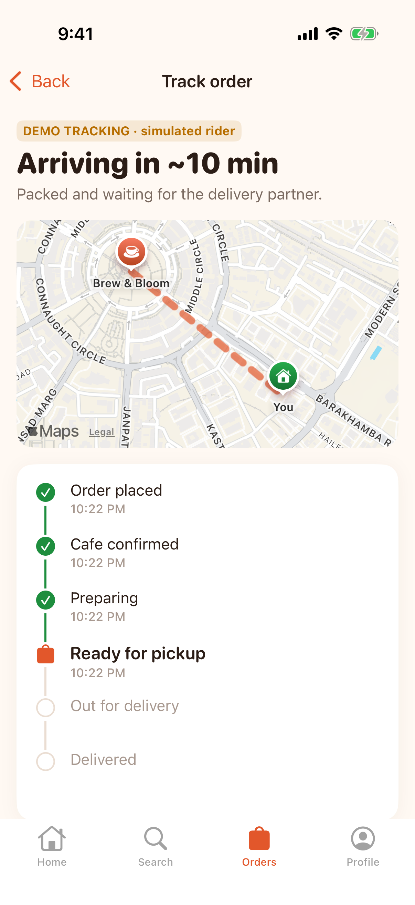 |

🎬 Screen recording of the full flow: [`docs/media/demo.mp4`](docs/media/demo.mp4)

## Repository layout

```
QuickBite/
├── backend/            Node.js + Express + Prisma + PostgreSQL + Socket.IO API (tests: node:test)
├── ios/
│   ├── Packages/
│   │   ├── NetworkKit/ reusable Swift package — typed endpoints, retries, token refresh, de-duplication
│   │   └── DesignKit/  reusable Swift package — design tokens + UIKit components + image cache
│   ├── QuickBite/      the app (App · Core · Features · Persistence · ObjC · Resources)
│   ├── QuickBiteTests/ & QuickBiteUITests/
│   ├── project.yml     XcodeGen spec (the .xcodeproj is generated)
│   ├── Podfile         CocoaPods (Razorpay SDK)
│   └── fastlane/
├── docs/               architecture · database (ER) · API · deployment · performance · presentation
├── ci/                 CI helper scripts
├── render.yaml         one-click backend + database deploy on Render
└── .github/workflows/  backend CI · iOS CI · migration generator
```

## Quick start (full local setup)

### 1. Backend (Node 20+, PostgreSQL 14+)

```bash
cd backend
cp .env.example .env               # set DATABASE_URL and the two JWT secrets
npm install                        # also runs `prisma generate`
npx prisma migrate deploy          # create tables
npm run db:seed                    # 7 cafés, ~60 dishes, coupons, demo users
npm run dev                        # http://localhost:4000  (health: /health)
```

<details><summary>Don't have PostgreSQL? (macOS)</summary>

```bash
brew install postgresql@16 && brew services start postgresql@16
createuser -s quickbite && createdb -O quickbite quickbite
# DATABASE_URL=postgresql://quickbite@localhost:5432/quickbite
```
</details>

Demo accounts: **demo@quickbite.app / Demo@1234** (customer, with saved addresses) and
**staff@quickbite.app / Staff@1234** (can move orders through statuses).

Orders advance automatically every 20 s (`DEMO_ORDER_PROGRESSION=true`) so you can demo live
tracking. Set it to `false` to drive orders yourself — see [docs/API.md](docs/API.md#staff--admin).

### 2. iOS app (macOS + Xcode 16)

```bash
brew install xcodegen cocoapods
cd ios
xcodegen generate                  # creates QuickBite.xcodeproj from project.yml
pod install                        # Razorpay SDK → creates QuickBite.xcworkspace
open QuickBite.xcworkspace
```

Pick an iPhone simulator and press **⌘R**. Builds talk to the live Render API by default. To use
the backend from step 1 instead, set `API_BASE_URL` to `http:/$()/localhost:4000` in
`ios/Config/Debug.xcconfig`, or switch in the app (**Profile → Server & diagnostics**).

Everything works without any third-party keys: payments use the **demo provider** (labelled
"DEMO" everywhere), Google/Apple sign-in offer a **demo sign-in** when not configured, and
order updates arrive in-app without push. Add real keys later — see
[docs/DEPLOYMENT.md](docs/DEPLOYMENT.md#optional-integrations).

### 3. Tests

```bash
# backend — unit tests need nothing; integration tests need a database
cd backend
npm run test:unit
DATABASE_URL=postgresql://…/quickbite_test npm run test:prepare && npm run test:integration

# iOS
cd ios/Packages/NetworkKit && swift test            # NetworkKit (runs on macOS)
cd ios && bundle exec fastlane test                 # app unit + UI tests (or ⌘U in Xcode)
```

**CI** runs all of this on every push: the backend suite against a real PostgreSQL service, and
the iOS build + unit + UI tests on a macOS runner. Check the badges above for the current status.

## Architecture in one picture

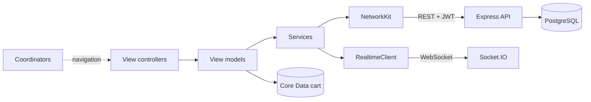

* [Architecture](docs/ARCHITECTURE.md): MVVM + Coordinator, modules, networking, cart sync, live tracking, offline strategy
* [Database & ER diagram](docs/DATABASE.md)
* [REST + realtime API reference](docs/API.md)
* [Deployment (Render, TestFlight, Firebase, Razorpay)](docs/DEPLOYMENT.md)
* [Performance & Instruments guide](docs/PERFORMANCE.md)
* [Demo script & résumé bullets](docs/PRESENTATION.md)

## Design system

Warm café palette (ember orange `#E2572B`, espresso text `#2B1D16`, cream background
`#FFF9F3`), SF Rounded headings with Dynamic Type, a 4-pt spacing grid, 8–24 pt corner radii,
dark mode variants for every colour, haptics, reduced-motion support, and VoiceOver labels on
custom controls. All tokens live in [`DesignKit/Tokens.swift`](ios/Packages/DesignKit/Sources/DesignKit/Tokens.swift).

## Security notes

* Prices, discounts, totals and payment status are **always computed or verified on the server**.
* Passwords hashed with bcrypt; refresh tokens stored hashed and rotated; tokens on device in the **Keychain**.
* Razorpay signatures verified server-side (HMAC-SHA256, constant-time compare); card data never touches our servers.
* Helmet security headers, rate limiting on auth, request validation (Zod) on every endpoint, ownership checks on every order/address/payment.
* No secrets in the repo — see `backend/.env.example` and `ios/Config/Secrets.example.xcconfig`.

## Honest status

| Item | Status |
| --- | --- |
| Backend API + tests | ✅ Unit + integration tests pass in CI against PostgreSQL |
| iOS build + unit/UI tests | See the **iOS CI** badge |
| Backend deployment | Live on Render: <https://quickbite-api-0zul.onrender.com/health> (free tier — first request after idle takes ~50 s) |
| Razorpay | Integrated (test mode); needs your test keys. Demo provider used otherwise |
| Push notifications | FCM integrated; needs your Firebase project + a real device |
| TestFlight / App Store | fastlane lane configured, **not published** |
| Performance numbers | Measurement guide provided; no figures claimed until measured |

## License

MIT — see [LICENSE](LICENSE). Food photos from [Unsplash](https://unsplash.com/license).
