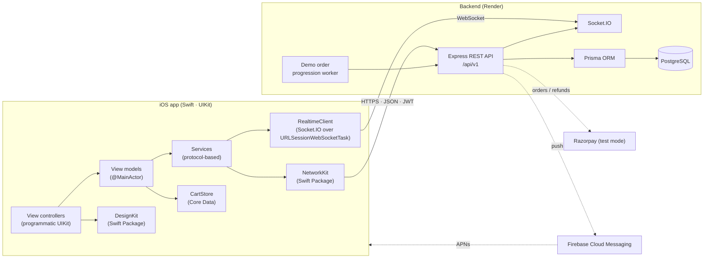
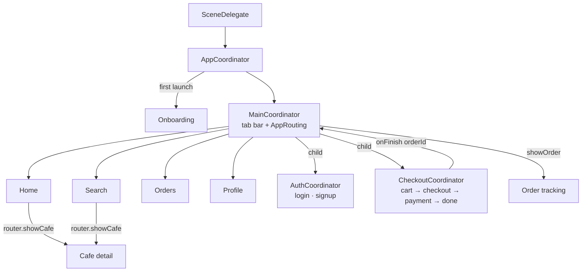
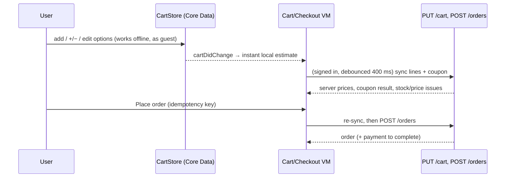

# QuickBite — Architecture

This document explains how the pieces fit together and *why* they're built this way.
Diagrams are Mermaid, which GitHub renders inline.

## 1. System overview



## 2. iOS app

### MVVM + Coordinator



* **View controllers** only build views and forward user intent. They never push or present
  other screens — they call `router.showCafe(id:)`, `router.showCart()`, … on the `AppRouting`
  protocol, which `MainCoordinator` implements.
* **View models** hold state and business rules, expose plain values/closures, and depend on
  *protocols* (`CatalogServicing`, `OrderServicing`, …). That's what makes them unit-testable
  with fakes (see `QuickBiteTests/TestSupport.swift`).
* **Coordinators** own navigation flows. Modal flows (`AuthCoordinator`, `CheckoutCoordinator`)
  are child coordinators that report back through a completion closure and are then released.
* **`AppEnvironment`** is the dependency container, built once at launch. Nothing reaches for
  a global singleton (apart from stateless helpers like `ImagePipeline.shared`).

### Module map

```
ios/
├── Packages/
│   ├── NetworkKit/        reusable: APIClient, Endpoint<T>, APIError, retries, token refresh, NetworkMonitor
│   └── DesignKit/         reusable: tokens (colours, type, spacing), QBButton, QBTextField, cards,
│                          skeletons, empty/error states, toasts, ImagePipeline (NSCache + downsampling)
├── QuickBite/
│   ├── App/               AppDelegate, SceneDelegate, AppEnvironment (DI), AppConfiguration, StubBackend (UI tests)
│   ├── Core/
│   │   ├── Models/        Codable models = the API contract
│   │   ├── Navigation/    Coordinator protocol, App/Main/Auth/Checkout coordinators
│   │   ├── Services/      API services, SessionStore (Keychain), RealtimeClient, Location, Push
│   │   ├── UI/            shared UIKit helpers (BillView, overlays)
│   │   └── Pricing.swift  bill & coupon rules mirrored from the server (for estimates)
│   ├── Features/          one folder per feature: view models + view controllers
│   ├── ObjC/              QBPriceFormatter (Objective-C) + bridging header
│   ├── Persistence/       CoreDataStack (model in code), CartStore, response cache, small stores
│   └── Resources/         Info.plist, assets, entitlements
├── QuickBiteTests/        unit tests (view models, pricing, Core Data cart, ObjC formatter, socket parser)
└── QuickBiteUITests/      XCUITest end-to-end flows against the stub backend
```

### Networking (NetworkKit)

`Endpoint<Response>` ties a request to the type it decodes into. `URLSessionAPIClient`:

1. builds the `URLRequest` (base URL, query, JSON body, `Authorization: Bearer …`);
2. **de-duplicates** identical in-flight GETs (an `actor` keeps one `Task` per URL);
3. on `401` asks the `AuthTokenProvider` (the app's `SessionStore`) to **refresh once** and
   replays the request — concurrent 401s share a single refresh;
4. **retries** idempotent requests (GET/PUT/DELETE, or POST with `allowsRetry` + an
   idempotency key) on timeouts / 502-504 with exponential backoff;
5. maps every failure to a small `APIError` enum with user-presentable messages.

### Cart: local first, server authoritative



The app **never sends prices**. It sends item ids, option ids and quantities; the server reads
prices from PostgreSQL, validates customisations, stock, opening hours, delivery radius and
coupons, and returns the bill. The local estimate uses the same formula (`PricingCalculator`,
tested against the same cases as the backend) so numbers don't jump at checkout.

### Live tracking

`RealtimeClient` speaks the Engine.IO v4 / Socket.IO v5 wire protocol directly over
`URLSessionWebSocketTask` (~200 lines, no dependency): handshake with the JWT, answer pings,
subscribe to `order:<id>` rooms with acks, reconnect with exponential backoff, refresh the token
on `connect_error UNAUTHORIZED`. The tracking screen also polls every 10 s whenever the socket
isn't connected, so tracking keeps working on networks that block WebSockets.

> **Demo tracking is labelled as demo.** There's no real rider app, so the backend's demo
> worker moves orders through the statuses and emits a *simulated* rider position on a straight
> line between café and customer. Every such order has `isDemoTracking = true` and the app shows
> a "DEMO TRACKING · simulated rider" badge. If an order has no coordinates, the map is hidden
> and the step tracker is the fallback.

### Offline & performance

| Concern | Implementation |
| --- | --- |
| Offline cart | Core Data, persisted on every change |
| Offline menus | `ResponseCache` writes recent home/cafe JSON to Caches/ on a background queue; shown with an "Offline" banner |
| Images | `ImagePipeline`: `NSCache` (memory, cost-based) + `URLCache` (disk), ImageIO downsampling off the main thread, in-flight de-duplication, collection-view prefetching |
| Duplicate requests | GET de-duplication in NetworkKit; debounced search (Combine) and cart sync |
| Main thread | All network/disk work is `async`; view models are `@MainActor` and only touch UI state |

How to measure (Instruments) and where to record real numbers: [`PERFORMANCE.md`](PERFORMANCE.md).

## 3. Backend

```
backend/
├── prisma/schema.prisma      data model (see DATABASE.md)
├── prisma/migrations/        SQL migrations (generated by Prisma)
├── prisma/seed.js            7 cafés, ~60 dishes, coupons, demo users
├── src/
│   ├── app.js                Express app: security headers, CORS, rate limits, routes, errors
│   ├── server.js             HTTP + Socket.IO + graceful shutdown
│   ├── config/env.js         all configuration from environment variables
│   ├── domain/               pure business rules (pricing, order state machine, payment signatures)
│   ├── routes/               auth, addresses, catalogue/search, cart, orders, payments, reviews, notifications, admin
│   ├── services/             cart pricing, orders, Razorpay client, FCM, social-token verification, demo worker
│   ├── realtime/socket.js    authenticated Socket.IO rooms
│   ├── middleware/           JWT auth, staff auth, centralised error handler
│   └── serializers.js        DB rows → stable JSON contract
└── tests/
    ├── unit/                 node:test — pricing, coupons, state machine, signatures
    └── integration/          node:test + real PostgreSQL + Socket.IO client
```

Key rules:

* **Order state machine** (`domain/orderStatus.js`): `PENDING_PAYMENT → PLACED → CONFIRMED →
  PREPARING → READY_FOR_PICKUP → OUT_FOR_DELIVERY → DELIVERED`, with `CANCELLED` allowed only
  before preparation. Every change goes through one function that uses a conditional update
  (`WHERE status = <from>`) so two concurrent updates can't both win.
* **Idempotent order creation**: `(userId, idempotencyKey)` is unique; a retried request returns
  the original order.
* **Payments**: online orders stay `PENDING_PAYMENT` until the server verifies the Razorpay
  HMAC signature (or the clearly labelled mock provider succeeds). A webhook is the safety net
  if the app dies mid-payment. Cancelling a paid order refunds it.
* **Auth**: short-lived JWT access tokens + rotating, hashed refresh tokens; reuse of a revoked
  refresh token revokes the whole session family.
