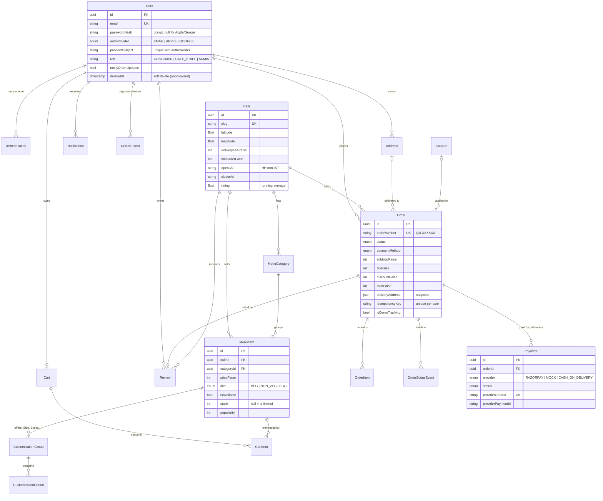

# QuickBite — Database

PostgreSQL via Prisma. All money columns are **integers in paise** (₹1 = 100 paise) so there is
no floating-point rounding anywhere. Primary keys are UUIDs. Source of truth:
[`backend/prisma/schema.prisma`](../backend/prisma/schema.prisma); SQL:
[`backend/prisma/migrations`](../backend/prisma/migrations).

## ER diagram



## Tables and why they exist

| Table | Purpose | Notable constraints / indexes |
| --- | --- | --- |
| **User** | Accounts for email, Apple and Google sign-in. Deleting an account anonymises the row (orders must remain for accounting) and removes addresses, devices, tokens. | `email` unique; `(authProvider, providerSubject)` unique |
| **RefreshToken** | One row per session. Stores a SHA-256 *hash* of the refresh token, its expiry and revocation time — enables logout, rotation and reuse detection. | `tokenHash` unique; index on `userId` |
| **Address** | Saved delivery addresses with coordinates (for distance, ETA and the tracking map). One default per user (enforced in a transaction). | FK → User (cascade) |
| **Cafe** | Café profile, location, fees, opening hours, rating aggregate. | `slug` unique; index on `isFeatured` |
| **MenuCategory** | Sections of a café's menu ("Coffee", "Bakery"). | `(cafeId, name)` unique |
| **MenuItem** | Dishes with price, diet label, availability, optional stock and popularity counter. | indexes on `cafeId`, `categoryId`, `name` |
| **CustomizationGroup / CustomizationOption** | "Size: choose 1", "Extras: up to 2" with per-option extra price. The server validates min/max selection and availability. | FK cascade from MenuItem |
| **Cart / CartItem** | Server copy of the user's cart. `lineKey = menuItemId + sorted optionIds` merges identical lines. Only ids and quantities are stored — prices are always read live. | `Cart.userId` unique; `(cartId, lineKey)` unique |
| **Coupon** | Flat or percentage discounts with min order, cap, validity window and per-user limit. | `code` unique |
| **Order** | The placed order with a **snapshot** of prices and the delivery address, so later menu/address edits never rewrite history. | `orderNumber` unique; `(userId, idempotencyKey)` unique; indexes on `(userId, createdAt)` and `status` |
| **OrderItem** | Line snapshot: name, unit price incl. options, options JSON, quantity, line total. | FK → Order (cascade) |
| **OrderStatusEvent** | Append-only timeline of status changes (drives the tracking screen's timestamps). | index on `orderId` |
| **Payment** | Each payment *attempt* (retries create new rows). Only provider reference ids are stored — never card data. | `providerOrderId` unique |
| **Review** | One rating/review per **delivered** order; updates the café's running average in the same transaction. | `orderId` unique; index `(cafeId, createdAt)` |
| **Notification** | In-app inbox; also the fallback when push isn't configured. | index `(userId, createdAt)` |
| **DeviceToken** | FCM registration tokens per device (moved to whoever signs in on that device; pruned when FCM reports them invalid). | `token` unique |

## Migrations

```bash
cd backend
npx prisma migrate dev --name <change>   # local: create + apply a migration after editing schema.prisma
npx prisma migrate deploy                 # CI/production: apply pending migrations
npm run db:seed                           # demo data (only seeds an empty database)
```

No local Prisma? The **Generate Prisma migration** GitHub workflow (Actions → Run workflow)
diffs the schema against existing migrations and commits a new migration for you. CI fails if
`schema.prisma` and the migrations ever drift apart.
